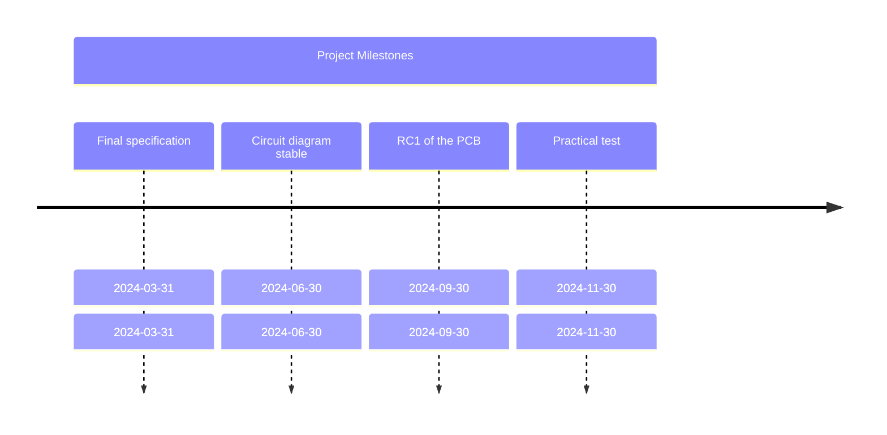

# YaHSB
Yet Another Highend Switch  Box
## Project Goal
Fully balanced switching box with volume level adjustment for the automated blind test of 4 sources, 3 amplifiers, and 3 pairs of speakers.
The ideas is to build a central unit with PSUs, MCU, rotary encoders and display connected to slave untis for doing the switching, and volume leveling. In this slave we can forsee an option Buffer stage.

## Motivation
My old mechanical switching box that I built 20 years ago is not symmetrical, and the level adjustment is only manual and with manual measurement. Moreover, it is only non balanced.

## License Condition
The developed hardware and software are open and free to use. Possibly under the MIT public license?

## Team
Appreciative and open minded. Building a small team would be great to complement our talents.

## Documentation
GitHub 


## Language
Depending on the team, English or German (thanks to AI, this is no longer a problem today).

Device itself should be configurable. (Initial german / english / french)

## schematics and PCB Layout
KiCAD 8
- SMD were reasonable
- TH where necessary
- reusibility in othe project

## Mechanical CAD
Freecad

## Basic Idea


## Brainstorming on Features

- 2 x 4 Inputs Balanced 
- 2 x 3 Outputs Balanced
- 2 x 3 Input Speaker 
- 2 x 3 Output Speaker
- Level attenuation programmable (can be bridged)
- Output Buffer can be configured into the signal path
- Synchronize test process with participant questionnaire
- Preamp mode
- Modules (can but do not have to be built separately)
  - PSU Analog
  - PSU Digital
  - MCU & Display & Hardware UI
  - Volume Leveling Hardware
  - Source Selector Input
  - Sink Selector Output to AMPS
  - AMP Selector Speaker
  - Optional: Buffer
  - Level Adjustment
  - Optional additional relay box for additional test scenarios

## Basic Requirements

- No Digital I/O with the slaves during listening
- Remotely configurable via IR / WiFi
- Online updates
- True Dual Mono possible
- Flexible preamp
- Open Source / Open Hardware (license type to be discussed)
- SMD where sensible, TH where necessary

## To be discussed

- Non balanced input / output

## User Stories Test Scenarios: (Idea generation unformatted)
### Configure Input/Output/SPKin/SPKout
- Allows to attribute a 32 Character Devicename to a connectio
- can be stored as a preset or temporary. 16 presets possible (Presets are different for each device group except output and SPKin (input / output / SPKout)
- deviceUI
- exposed via API

### Definition listening path

- Maximum 32 pathes
- a listening path contains
- - Input
  - Output
  - Buffer usage
  - Volume adjustment
  - SPKin
  - SPKout

- deviceUI
- exposed via API:
```json
{
    "PathName": "TextDescription of path",
    "Channels": {
        "L": {
            "Input": "inp1",
            "Input_desc" : "TextDescription of Input",   
            "Buffer": "Yes",
            "Level Adjustment": "-x DB",
            "Output": "out1",
            "Output_desc" : "TextDescription of Output",
            "SPKin" : "SPKin1",
            "SPKin_desc" : "TextDescription of Speaker_in",
            "SPKout": "SPKout1"
            "SPKout_desc" : "TextDescription of Speaker_out",
            },
        "R": {
            "Input": "inp1",
            "Input_desc" : "Bricasti M12",
            "Buffer": "No",
            "Level Adjustment": "-12 DB",
            "Output": "out1",
            "Output_desc" : "McIntosh MC275",
            "SPKin" : "SPKin1",
            "SPKin_desc" : "4 Ohm Output MC275",
            "SPKout": "SPKout1"
            "SPKout_desc" : "Magico Q5",
            }
  }
}
```

### Configuration Test Source Signal
Here we Define the source of the test signals. In case of beeing Digital they can be trigger via a UPNP Playlist, or via a Playlist in roon.
- UPNP control [endpoint / playlist]
- Roon API [endpoint / playlist]
- Manual for non streaming content.

### Automatic Volume Leveling
### Test Scenarios

- AMP Test
- Speaker Test
- Source Test

### Test Process

- BLIND Scenario [1,2,3---]
- Include obfuscation by different volume levels
- Manually Switched
- Online questionnaire during the test

## Project Milestones

- End of March 2024: Final specification
- End of June 2024: Circuit diagram stable
- End of September 2024: RC1 of the PCB
- End of November 2024: Practical test

Is anyone interested?
